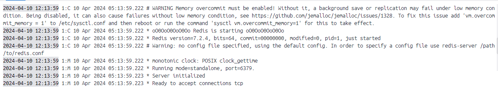

## Use Nginx official image from registry

pull image
```
docker image pull nginx:1.25.4
```

view all images
```
docker images
or
docker image ls
```

view all run containers
```
docker ps
or
docker container ps
```

run container Nginx
```
docker container run -d nginx:1.25.4
```

try to open nginx web view
```
http://localhost:80
or
http://127.0.0.1:80
```

stop container by id
```
docker container stop <id>
```

view all containers
```
docker ps -a
or
docker container ps -a
```

remove container by id
```
docker container rm <id>
```

remove all unuse containers
```
docker container prune
```

run container config port
```
docker container run -d -p 7777:80  nginx:1.25.4
```

try to open nginx web view
```
http://localhost:7777
or
http://127.0.0.1:7777
```


run container config container name
```
docker container run -d -p 7777:80 --name nginx-demo nginx:1.25.4
```

create index.html
```
<h1>Hello world</h1>
``` 

copy file into container
```
docker cp index.html <id>:/usr/share/nginx/html/index.html
```

## Use Postgres official image from registry

pull image
```
docker image pull postgres:16
```

run container postgres
```
docker container run postgres:16
```

run container postgres with set password config
```
docker container run --name db -e POSTGRES_PASSWORD=postgres -d postgres:16
```

run container postgres with more config
```
docker container run --name db -e POSTGRES_PASSWORD=postgres -e POSTGRES_USER=postgres -e POSTGRES_DB=postgres -d postgres:16
```

go insite db container
```
docker container exec -it db bash
psql -d postgres -U postgres
```

Change database
```
\c postgres
```

Show all tables
```
\dt
```

Quit database
```
\q
```

Quit container
```
exit
```

## Workshop redis

try to use redis offial image create container and it will has log as image below


