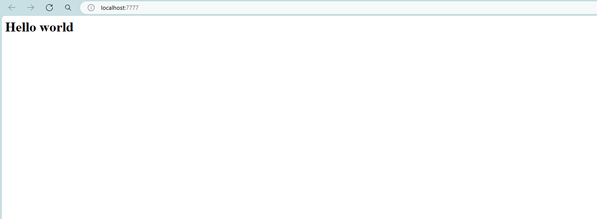

## Custom Nginx official image with Dockerfile

create Dockerfile
```
FROM nginx:1.25.4
COPY index.html /usr/share/nginx/html/index.html
```

create image from docker file
```
docker image build -t demo:1.0 .
```

YES!!! we have new custom image
```
$docker images
REPOSITORY                TAG            IMAGE ID       CREATED          SIZE
demo                      1.0            146cefd8a34b   12 seconds ago   187MB
```

run container custom image
```
docker container run -d -p 7777:80 --name nginx-custom demo:1.0
```

try to open nginx web view
```
http://localhost:7777
or
http://127.0.0.1:7777
```



## Push custom image to Dockerhub

logout docker
```
docker logout
```

login docker
```
docker login
```

try to push image
```
docker push demo:1.0
```

copy demo:1.0 image and add tag to image
```
docker image tag demo:1.0 <your_docker_username>/demo:1.0
```

try to push image again
```
docker push <your_docker_username>/demo:1.0
```

## Import and export image

export image as tar file **(note: do not use powershell)**
```
docker image save demo:1.0 > demo.tar
```

import image from tar file **(note: do not use powershell)**
```
docker image import demo.tar demo:2.0
```

## Create PostgresDB with Dockerfile

**Change directory to database folder**

create Dockerfile
```
FROM postgres:16.0
COPY table.sql /docker-entrypoint-initdb.d/1.sql
COPY data.sql /docker-entrypoint-initdb.d/2.sql
```

build postgres image
```
docker image build -t demo-postgres:1.0 .
```

run container from postgres image
```
docker container run -d -e POSTGRES_USER=postgres -e POSTGRES_PASSWORD=1234 -e POSTGRES_DB=postgres --name db demo-postgres:1.0
```

go insite db container
```
docker container exec -it db bash
psql -d postgres -U postgres
```

Change database
```
\c postgres
```

Show all tables
```
\dt
```

Get all data from table merchants
```
select * from merchants;
```

Quit database
```
\q
```

Quit container
```
exit
```

## Verify Dockerfile with Docker Build Check

Change directory to dockerfile folder and type command
```
docker build --check .
```

**Try error**

In Dockerfile
```
FROM nginx:1.25.4
CMD "echo Hello, world!"
COPY index.html /usr/share/nginx/html/index.html
```

**Try error and return error for CI\CD**

In Dockerfile
```
# check=error=true

FROM nginx:1.25.4
CMD "echo Hello, world!"
COPY index.html /usr/share/nginx/html/index.html
```